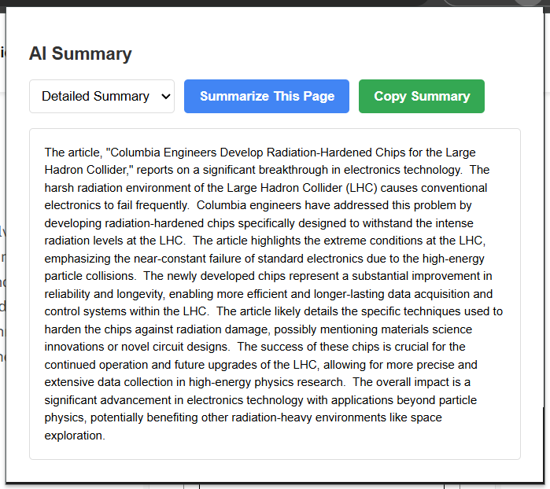

# 🧠 AI Summarizer – Chrome Extension


A lightweight Chrome Extension that uses **Gemini API** to summarize the content of any webpage instantly.

---

## 🛠️ Tech Stack

- JavaScript (Vanilla)
- HTML/CSS
- Chrome Extension API (Manifest V3)
- Google Gemini API

---

## 🧩 How to Load the Extension

1. Open Chrome and go to `chrome://extensions/`
2. Enable **Developer Mode** using the toggle at the top right
3. Click **"Load unpacked"**
4. Select the folder where this extension’s `manifest.json` is located
5. The AI Summarizer icon should now appear in your Chrome toolbar 🎯

---

## ⚙️ How It Works

- The extension injects a script (`content.js`) into the current tab to extract the page text
- It sends that text to **Gemini API** with a summarization prompt
- The summary is returned and displayed inside a minimal UI via `popup.html`
- You can trigger summarization with a single click from the extension popup

---

## 📂 Folder Structure
```
ai-summarizer/
├── assets/ # Images or banners (optional)
├── background.js # Background service worker (optional logic)
├── content.js # Extracts text from the webpage
├── icon.png # Extension icon
├── icon1.png # Alternate icon
├── manifest.json # Extension configuration
├── options.html # Options page (if used)
├── options.js # Script for options page
├── popup.html # UI for summarizer
├── popup.js # Handles popup logic
├── LICENSE # License info

```

---

## ✍️ Made with ❤️ by Piyush Gupta

Feel free to connect, contribute, or fork this project.  
Pull requests and stars are always welcome ⭐

